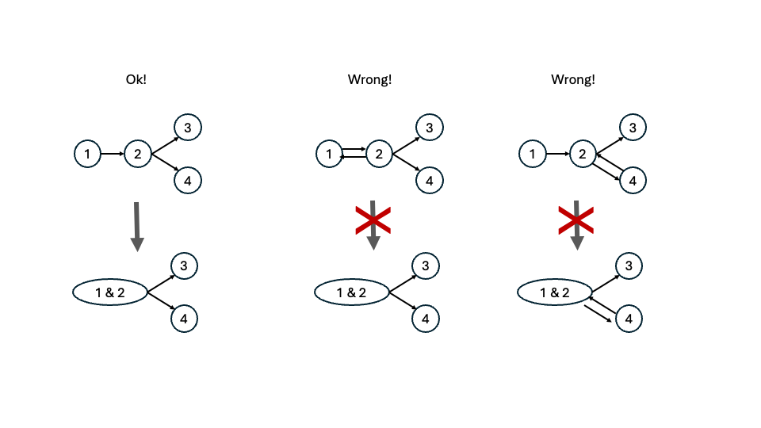

# Implementation of CSR creation tool

The project aims at creating a software in c/c++ that takes as input a genome graph in GFA format (use the ebola.gfa file provided) and outputs two different CSR structures.
In particular the steps required are:
- Reading a GFA file and saving all the Segments and Link in ad hoc structures.
- Unify the adjacent Segments that could be see as a unique node as they represent a single possible path passing between those nodes (example in the picture).
- Creation of a CSR (out-edges) structure of the unified graph with sequences in the nodes (composed of three arrays: IDs, adjacencies and offsets)
- Creation of a CSR (out-edges) structure with characters in the nodes (composed of three arrays: IDs, adjacencies and offsets)
- Outputs of two files coming from the two CSR structures as two new GFAs

Additional:
- Create also the in-edges CSR, with two additional files

