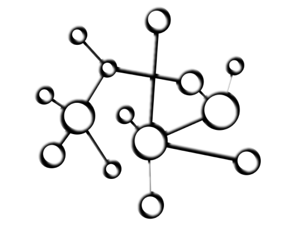

# GML-Fall25
Material for the Graph Machine Learning (GML) Passion In Action course

## Info, Materials and Deliverables
- You can work in group of max 2 people.
- You must provide the source code of your project, with the results obtained and a document (short, even 2-3 pages is fine) with comments on your implementation choices.
- Also partial projects will be evaluated.

## Deadlines
- 21 Nov 2025 : Communication via email to the tutor of the project selected (leonardo.degrandis@polimi.it)
- 11 Jan 2026 : Send an email with the deliverables

